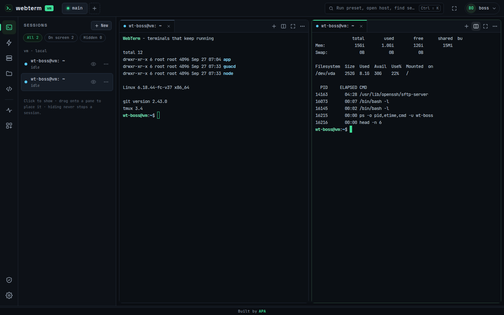
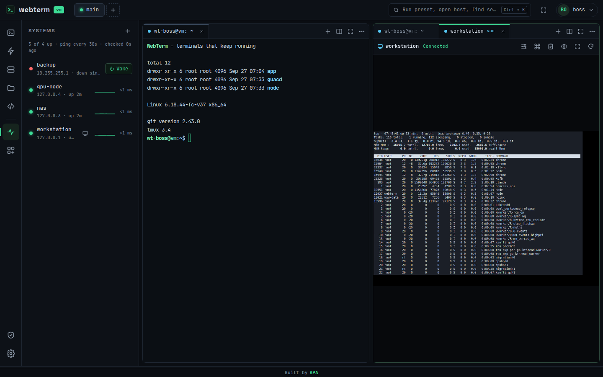
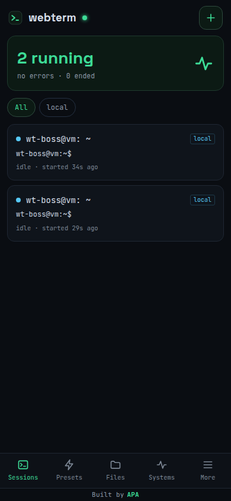

<div align="center">


# WebTerm

**Your terminals keep running. Even when you don't.**

A self-hosted, multi-user web workspace for Linux servers: persistent terminals,
SSH, file management, a VS Code IDE, machine monitoring with Wake-on-LAN, and
remote desktops (VNC and RDP with sound). All of it runs in the browser, on desktop and phone.

[Features](#features) ·
[Install](#install) ·
[HTTPS](#https-certificates) ·
[Documentation](#documentation) ·
[License](#license)

</div>



---

## Why WebTerm

- **Close the tab, keep the job.** Terminals are owned by a small privileged
  broker, not by your browser or even the web server. Long builds, simulations
  and `tail -f` sessions survive closing the browser, signing out, losing Wi-Fi
  and restarting the WebTerm web service. Reopen WebTerm anywhere and you get the
  exact screen and scrollback back.
- **Real Linux users, real permissions.** Every WebTerm account runs its shells
  and file operations as its own Linux account. User sessions never run as root.
- **One place for the whole lab.** Shared SSH keys, one-click presets, file
  transfer between servers, ping status and Wake-on-LAN for your machines, and
  their screens, all in one tab.
- **Installs in one command** on Ubuntu or Debian, with a free Let's Encrypt
  certificate if you have a domain.

## Features

### Terminals
- Persistent sessions that survive browser closes, sign-outs and web server restarts
- Exact screen + scrollback restore when you reconnect (headless xterm mirror)
- Tabs, side-by-side and stacked splits, floating windows, drag-and-drop layout
- Multiple **workspaces** (named layouts) per user; hide sessions without stopping them
- Local shells as your Linux user, and SSH sessions to shared hosts
- Optional **remote tmux** for SSH sessions: the remote job survives even if the connection drops
- Session colors, rename, restart, "notify me when the command finishes"
- Search in output, clickable links, inline images, Unicode 11, WebGL rendering
- 7 built-in themes (Phosphor, Dracula, Nord, One Dark, Solarized, GitHub Dark, Paper)
  plus import of Windows Terminal / iTerm2 themes; font, size, cursor and scrollback settings

### Presets
- Save a "terminal recipe" once: local or SSH, working directory, startup commands
- `${input:name}` placeholders ask for a value each time the preset runs
- Open as split, tab, floating window or in the background; share presets with all users

### SSH hosts and Vault
- Administrators store SSH keys and passwords once, **encrypted at rest** (AES-256-GCM)
- Generate ed25519 keys, import keys, or store passwords; choose which users may use each credential
- "Install key on host" (asks the host password once), connection test
- Host fingerprints are pinned on first connect; a changed fingerprint blocks the connection

### Files
- File browser for the server **and** every SSH host (SFTP), running as your own user
- Upload files and whole folders of any size (streamed), download files or folders (`.tar.gz`)
- Copy and move between servers, cut / copy / paste, rename, delete, new file / folder
- Permissions editor, hidden files, filter, sortable columns, drag and drop
- Built-in text editor with "changed on disk" conflict detection
- Side panel, full window or floating window; "Open in IDE" for folders

### IDE
- VS Code in the browser ([code-server](https://github.com/coder/code-server)) per user,
  behind the WebTerm login, as a pane next to your terminals or in its own tab

### Systems (monitoring and Wake-on-LAN)
- Watch machines with ping (TCP fallback when ICMP is not allowed), response-time sparkline, up/down since
- **Wake-on-LAN** with custom broadcast addresses
- **Remote desktop**: VNC (the physical screen, including the login screen) and
  **RDP with sound** (its own session) right in a WebTerm pane
- Ready-made setup scripts for Windows (TightVNC / built-in Remote Desktop) and Linux (x11vnc / GNOME Remote Login)

### Shell plugins
- One-click install of IRIS, fzf, zoxide and Starship on the server or any SSH host, plus your own custom plugins
- Installs run in a visible terminal; enabling adds one guarded line to `~/.bashrc` / `~/.zshrc`

### Administration
- Users and roles (user / admin), no public sign-up
- Per user: Linux account (new `wt-<name>`, existing, or SSH-only), IDE access, terminal limit, credentials
- Reset passwords, sign users out everywhere, disable or delete accounts
- Audit log of sign-ins, connections, file downloads and admin actions

### Everywhere
- Dedicated **mobile interface** with a key bar (Esc, Ctrl, Tab, arrows) and a command box
- Installable as an app (PWA)
- Each user sees their signed-in devices and can sign any of them out
- Command palette (`Ctrl+Shift+K`) to run presets, open hosts and find sessions

<table>
<tr>
<td width="68%"></td>
<td></td>
</tr>
</table>

## Install

**Requirements:** Ubuntu 22.04 / 24.04 or Debian 12 (x86_64 or arm64), systemd, root access.
x86_64 releases bundle everything needed. On arm64 the installer downloads Node.js and compiles the terminal module.

1. Download the latest release archive from the
   [Releases page](https://github.com/aapejmanmanesh/Web-terminal/releases) and unpack it:

   ```bash
   tar -xJf webterm-1.3.1.tar.xz
   cd webterm-1.3.1
   ```

2. Run the installer:

   ```bash
   sudo ./install.sh
   ```

3. Answer the questions:

   ```text
   Create the WebTerm administrator account
     Administrator username: alice
     Password for alice (at least 10 characters):
     Repeat the password:

   HTTPS certificate
     1) Automatic: a free Let's Encrypt certificate for your domain (recommended).
     2) My own certificate: PEM certificate (full chain) and private key files.
     3) Self-signed: works without a domain, but browsers show a security warning.
     Choose 1, 2 or 3 [3]:
   ```

When it finishes, the installer prints the address to open, for example `https://term.example.com`
or `https://203.0.113.10:8443`. Sign in with the administrator you just created.

> You can also install straight from a clone of this repository (`git clone …`, then `sudo ./install.sh`).
> The installer then downloads Node.js and builds the terminal module itself, so it takes a little longer.

Everything can be given up front for unattended installs:

```bash
sudo ADMIN_USER=alice ADMIN_PASS='a-long-password' \
     DOMAIN=term.example.com EMAIL=you@example.com ./install.sh
```

See [docs/installation.md](docs/installation.md) for all options, what gets installed where, upgrades and uninstalling.

## HTTPS certificates

| Option | You need | What happens |
|---|---|---|
| **1. Let's Encrypt** (recommended) | A domain (e.g. `term.example.com`) with a DNS **A record** pointing to the server; ports **80 and 443** open | nginx is set up in front of WebTerm, a free trusted certificate is requested and **renewed automatically**. If the certificate can't be issued yet (for example, DNS isn't updated), WebTerm starts with a temporary certificate and **retries every hour by itself** until it succeeds. |
| **2. Your own certificate** | A PEM certificate (full chain) and its private key | The files are checked (valid, not password-protected, key matches). Served by nginx on your domain, or directly by WebTerm on port 8443. |
| **3. Self-signed** | Nothing | Works immediately on `https://<server-ip>:8443`. Browsers show a warning the first time. |

Change it later at any time:

```bash
sudo ./install.sh --https
```

Full details, DNS examples and troubleshooting: [docs/https.md](docs/https.md).

## Upgrade

Download the new release, unpack it and run `sudo ./install.sh` again. Users, sessions, presets,
the vault and settings are kept, and no questions are asked. Running terminals keep running unless the terminal
broker itself changed (you are asked before it restarts).

## Uninstall

```bash
sudo ./uninstall.sh           # remove WebTerm, keep data in /var/lib/webterm and /etc/webterm
sudo ./uninstall.sh --purge   # also delete all data and service accounts
```

## Documentation

| Guide | Contents |
|---|---|
| [Installation](docs/installation.md) | Requirements, installer questions and options, file locations, services, upgrade, uninstall |
| [HTTPS](docs/https.md) | Let's Encrypt, own certificates, self-signed, switching later, renewals |
| [User guide](docs/user-guide.md) | Terminals, workspaces, presets, SSH, files, IDE, systems, plugins, settings, mobile, shortcuts |
| [Administration](docs/administration.md) | Users, Linux accounts, Vault & hosts, audit log, `webterm-admin`, configuration file, backups |
| [Remote desktop](docs/remote-desktop.md) | Setting up VNC and RDP on Windows and Linux machines |
| [Security](docs/security.md) | Architecture and security model |
| [Troubleshooting](docs/troubleshooting.md) | Logs and fixes for common problems |
| [Development](docs/development.md) | Repository layout and building a release |
| [Changelog](CHANGELOG.md) | What changed in each version |

## How it works

```text
 Browser ──HTTPS/WebSocket──► nginx (optional, :443) ──► webterm (web server, unprivileged, :8443 / 127.0.0.1)
                                                            │  unix socket
                                                            ▼
                                                   webterm-broker (root, owns every terminal)
                                                            │  setpriv: drops to the user's Linux account
                                                            ▼
                                        bash / ssh / sftp-server / tmux running as that user
```

- **webterm**: the web server and API (Node.js), running as the `webterm` service user under strict systemd sandboxing.
- **webterm-broker**: the only privileged part. It owns every terminal process so sessions outlive the web server,
  and starts each one as its owner's Linux account (never root, never a system account).
- **webterm-guacd**: Apache Guacamole's proxy for RDP, listening on `127.0.0.1` only.

More in [docs/security.md](docs/security.md).

## License

WebTerm is released under the [MIT license with an attribution clause](LICENSE): you may use, change and
share it freely, as long as every page of the interface keeps the **"Built by APA"** credit linking to
[github.com/aapejmanmanesh](https://github.com/aapejmanmanesh).

---

<div align="center">

Built by [**APA**](https://github.com/aapejmanmanesh)

</div>
