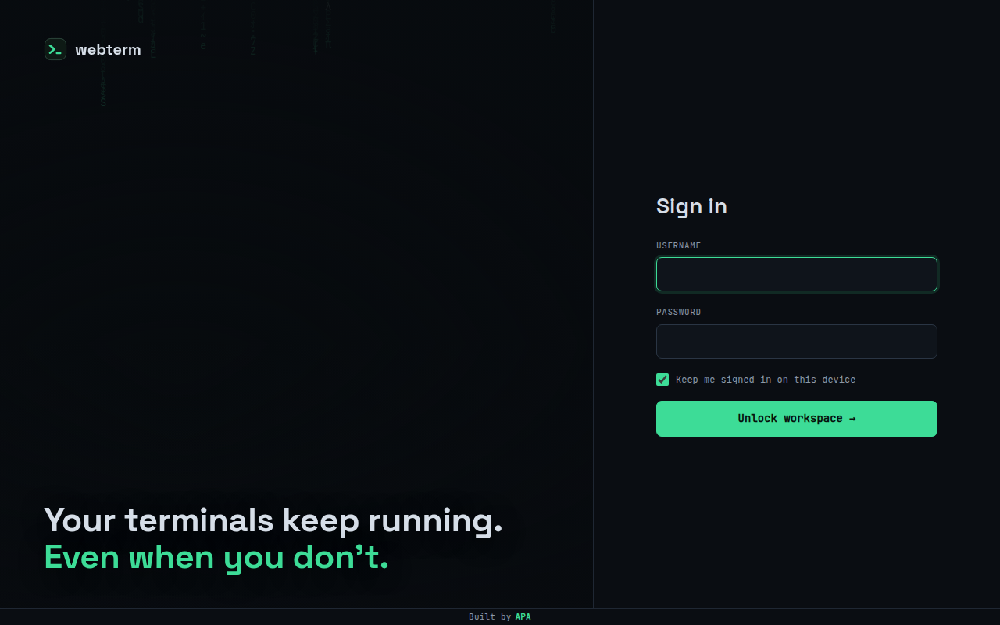
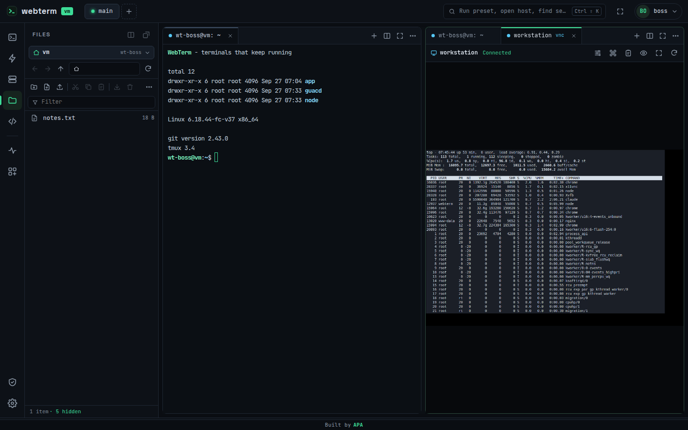

# User guide

- [Signing in](#signing-in)
- [The workspace](#the-workspace)
- [Terminals](#terminals)
- [Workspaces and layouts](#workspaces-and-layouts)
- [Presets](#presets)
- [SSH hosts](#ssh-hosts)
- [Files](#files)
- [IDE](#ide)
- [Systems and remote desktop](#systems-and-remote-desktop)
- [Shell plugins](#shell-plugins)
- [Settings](#settings)
- [Phones and tablets](#phones-and-tablets)
- [Keyboard shortcuts](#keyboard-shortcuts)

## Signing in

Open the address your administrator gave you (for example `https://term.example.com`) and sign in.
There is no public sign-up. Administrators create accounts.

- **Keep me signed in on this device** keeps you signed in for 30 days (configurable). Without it, the
  session ends after 12 hours of inactivity.
- After several wrong passwords, sign-in is blocked for a while, per account and per network address.
- **Signing out never stops your terminals.** They keep running on the server until you close them.

## The workspace

| Area | What it is |
|---|---|
| Top bar | Server name, your **workspaces** (tabs), the search / command palette, full screen, your account menu |
| Left rail | Panels: Sessions, Presets, SSH hosts, Files, IDE · Systems, Shell plugins · Administration (admins), Settings |
| Side panel | The selected panel. Drag its edge to resize, double-click the edge to reset. `Ctrl+Shift+E` shows / hides it. |
| Main area | Your terminals, file windows, editors, IDE and remote desktops, arranged freely |
| Status bar | Running / on-screen / hidden sessions, systems up / down, connection state, your Linux account |
| Footer | "Built by APA" |

## Terminals

### Opening terminals

- **New terminal** (Sessions panel, or `Ctrl+Shift+O`) opens a shell on the server as your Linux account.
- **SSH hosts panel → ▶** opens an SSH session to a shared host.
- **Presets** open preconfigured terminals (see [Presets](#presets)).
- The `+` button in a pane's tab bar opens a new terminal in that pane. The pane's `⋯` menu has
  *New terminal below*, *New local terminal to the right*, *File browser here* and more.

### They keep running

Closing the browser tab, signing out, losing the network, or updating WebTerm doesn't stop a terminal.
When you come back, from the same or any other device, you get the same screen and scrollback.
A terminal ends only when its program exits or you close it.

- **Hide (keeps running)**: middle-click a tab, or use its menu. Hidden sessions are listed under
  **Sessions → Hidden**. Click one to show it again, or drag it anywhere in the layout.
- **Close / terminate**: the tab's `×`. By default WebTerm asks before terminating a session that is still
  running a program (see [Settings](#settings)).
- When the program in a terminal exits, the pane shows *Process exited* with **Run again** and **Close**.

### Arranging

- **Drag a tab** onto another pane's edge to split, onto its tab bar to join, or out as a floating window.
- The pane toolbar splits right / down, maximizes a pane, and floats it.
- Floating windows can be moved and resized, and docked back by dragging their handle onto the layout
  (full, half or quarter).
- Double-click a tab to **rename** the session. The tab menu also sets a **color**.

### In the terminal

- **Copy:** `Ctrl+Shift+C`, or `Ctrl+C` while text is selected. **Paste:** `Ctrl+Shift+V`.
  Optional *Copy on select* and *Right-click to paste* are in Settings.
- **Find in output:** `Ctrl+Shift+F`.
- Links are clickable. Programs that print images (sixel / iTerm protocol) show them inline.
- **Notify when command finishes**: from the session menu (or the preset option). You get a
  notification in any open WebTerm window when the command ends.

## Workspaces and layouts

A workspace is a named layout of panes. Use them for different projects: `thesis`, `cluster`, `web`.

- **+** in the top bar creates a workspace. Double-click a workspace tab to rename it. Right-click it to delete it.
- Each workspace remembers its layout. Switching workspaces never stops terminals, and sessions not placed in the
  current workspace appear under *Hidden*.
- Deleting a workspace keeps its terminals running (they move to *Hidden*).
- Layouts follow your account: sign in elsewhere and they're the same.

## Presets

A preset is a terminal recipe you run with one click.

| Field | Meaning |
|---|---|
| Name | Shown in the Presets panel and the command palette |
| Type | **Local shell** (on the server) or **SSH** (choose a host) |
| Working directory | Where the shell starts, e.g. `~/sims/1AKI` |
| Startup commands | Typed in order once the shell is ready. `${input:run_name}` asks you for a value each time the preset runs. |
| Protect against network drops *(SSH)* | Runs inside tmux on the remote host, so the job continues even if the connection drops, and you reconnect to it |
| Notify me when the command finishes | Desktop notification in any open WebTerm window |
| Share with all users *(admins)* | Everyone sees it; only admins can edit it |
| Open as | Split right, split down, new tab, floating, or in the background |
| Color | The session's color |

**Save & run** saves and starts it. **Test connection** checks the SSH host first.
Presets also appear in the command palette (`Ctrl+Shift+K`).

## SSH hosts

The **SSH hosts** panel lists the machines your administrator shared with you. Credentials come from the
shared Vault, so you never handle keys or passwords yourself.

For each host: **▶ Connect**, *Open shell to the right*, *Browse files* (in a window or floating),
*Test connection*, and *New preset for this host…*.

Host fingerprints are pinned on the first connection. If a host's key changes, WebTerm refuses to connect
until an administrator confirms it (this protects against man-in-the-middle attacks).

## Files

The file browser works on the server (as your Linux account) and on every SSH host you have access to.
Open it from the **Files** panel, or as a window / floating window with the buttons at the top of the panel.

- **Location:** the button at the top switches between *This server* and your SSH hosts.
- **Navigate:** double-click folders; Back / Forward (`Alt+←` / `Alt+→`), parent (`Backspace`).
  Double-click the path bar to type a path, then press `Enter`.
- **Select:** click, `Ctrl`/`Shift`+click, `Ctrl+A`, arrow keys.
- **Toolbar:** new folder, new file, upload (files or a whole folder), cut / copy / paste, download, delete, more.
- **Upload:** use the Upload button or drag files and folders from your computer into the list. Uploads of any
  size are streamed, with progress shown at the bottom. If a file already exists, you're asked what to do.
- **Download:** single files download as they are. Folders and multiple items download as a `.tar.gz` archive.
- **Copy / move between servers:** copy or cut on one location, paste on another. Transfers run in the
  background and can be cancelled.
- **Rename** (`F2`), **delete** (`Del`), **copy path**, **properties & permissions** (owner, size, dates, chmod).
- **Filter** by name, **show hidden** files, sort by name / size / modified / permissions / owner.
- **Edit text files:** double-click a text file to open it in the built-in editor. `Ctrl+S` saves. If the file
  changed on disk since you opened it, you're asked before overwriting.
- **Open in IDE:** right-click a folder.

Everything runs with your own permissions. You can't read other users' files unless Linux allows it.

## IDE

If your account has IDE access and code-server is installed, the **IDE** panel starts VS Code in the browser,
running as your Linux account, behind the WebTerm login.

- **Open IDE**: a pane next to your terminals. **New window**: another IDE beside the first.
  **Floating**: in a floating window. **Browser tab**: full screen in its own tab.
- **Stop** shuts your IDE down (it starts again when you open it).
- Extensions and settings are stored in your home directory.

## Systems and remote desktop

The **Systems** panel watches machines on your network.

- A dot shows the state: green **up**, red **down**, amber **waking**, grey **checking**.
- Each row shows the address and how long the machine has been up or down, a response-time sparkline and
  the latest round-trip time.
- **Wake** (for machines that are down and have a MAC address) sends Wake-on-LAN packets. The row shows
  *waking…* until the machine answers.
- The status bar shows `▲ up ▼ down`. Click it to open the panel.

Administrators add systems with **+**: name, IP / host, MAC address, broadcast address, ping interval and the
remote desktop settings (see [Remote desktop](remote-desktop.md)).

### Remote desktop

If a system has VNC or RDP set up and you're allowed to use it, the **screen** button on its row opens it.
Right-click the button to open it floating.

| | VNC | RDP |
|---|---|---|
| Shows | The machine's **physical screen**, including the login screen | Its **own session** (you sign in as a user) |
| Sound | No | Yes |
| Good for | Helping someone at the machine, headless boxes | Working remotely on Windows Pro / GNOME |

Toolbar options:

- **Scaling:** *Fit (keep aspect)*, *Match window*, and (RDP) *Match window (sharp, HiDPI)* or (VNC) *Server resolution*.
- **Quality:** VNC has frame rate, quality and compression. RDP has *Best (lossless)*, *Balanced* and *Fast (16-bit)*.
- **Special keys:** `Ctrl+Alt+Del`, `Alt+Tab`, `Windows/Super`, `Ctrl+Alt+←/→`, `Escape`, `F11`.
- **Clipboard** sync, **view only**, **full screen**, **reconnect**, and (RDP) sound on / off.

## Shell plugins

Small tools that improve your shell, installed into your home directory on the server or on any SSH host
(choose the **Target** at the top of the panel):

| Plugin | What it does |
|---|---|
| IRIS | IntelliSense-style command suggestions |
| fzf | Fuzzy finder: `Ctrl+R` history, `Ctrl+T` files |
| zoxide | Smarter `cd`: jump anywhere with `z` |
| Starship | Fast, informative prompt |

- **Install** runs in a terminal so you can watch it (and answer prompts, e.g. `sudo`).
- The switch **enables** or **disables** a plugin. Enabling writes `~/.config/webterm/plugins.sh` and one guarded
  line in `~/.bashrc` and `~/.zshrc` that loads it. New terminals pick up the change.
- **Edit config**, **Update** and **Remove** are in a plugin's details (click its row).
- **+ Add custom plugin**: your own name, the command it installs (to detect it), install commands, and the
  lines to add for bash / zsh.
- **Re-check** looks again at what is installed on the target.

## Settings

Open **Settings** from the rail (gear icon) or the account menu. Changes are saved to your account and follow you
to every device.

- **Terminal:** theme (Phosphor, Dracula, Nord, One Dark, Solarized, GitHub Dark, Paper, or *Import theme* from a
  Windows Terminal / iTerm2 JSON file), font family, size, size on phones, line height, cursor style,
  scrollback lines, blinking cursor, GPU rendering (WebGL; turn it off if text looks wrong), copy on select,
  right-click to paste (needs a trusted certificate), ask before terminating a running session, bell sound.
  A live preview shows the result.
- **Account & password:** change your password. All your other devices are signed out.
- **Signed-in devices:** every browser signed in to your account, with its address and last activity.
  Sign out any of them (their terminals keep running).
- **Shortcuts:** the list below.

## Phones and tablets

On a phone, WebTerm switches to a touch interface:

- **Sessions**: all terminals with status and last output line, filtered by server / host. Tap to open, **+** for a new one.
- In a terminal: a **key bar** (`Esc`, `Ctrl`, `Tab`, arrows and more) and a **command box**. Type a whole command,
  then send it. The `⋯` menu renames, pastes or terminates the session.
- **Presets**, **Files** and **Systems** (with Wake) work as on the desktop.
- **Add to Home Screen** installs WebTerm as an app (needs a trusted certificate).

 

## Keyboard shortcuts

| Shortcut | Action |
|---|---|
| `Ctrl+Shift+K` (or `Ctrl+K` outside a terminal) | Search: presets, hosts, sessions, actions |
| `Ctrl+Shift+O` | New local terminal |
| `Ctrl+Shift+E` | Show / hide the side panel |
| `Ctrl+Shift+F` | Find in terminal output |
| `Ctrl+Shift+C` · `Ctrl+C` with a selection | Copy |
| `Ctrl+Shift+V` | Paste |
| Double-click a tab | Rename the session |
| Middle-click a tab | Hide the session (keeps running) |
| Drag a tab | Split, move, or drop into another pane |
| Drag a session from the list | Place it anywhere in the layout |
| File browser: `F2` / `Del` / `Backspace` / `Alt+←` / `Alt+→` | Rename / delete / parent folder / back / forward |
| Editor: `Ctrl+S` | Save |
